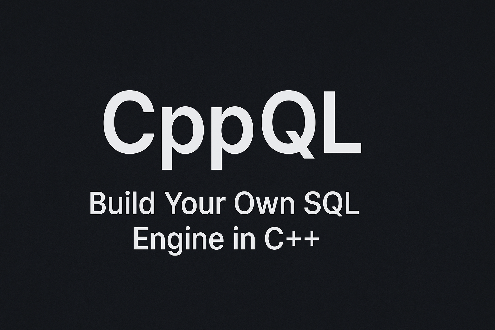

# CppQL

<p align="center">
  
</p>

CppQL (**C++ Query Language**) is a **mini SQL engine written in C++**.  
It is designed as an **educational project** for learning how databases and query engines work under the hood.

Through this project, you will implement a simplified SQL system step by step — building everything from parsing queries to executing them against in-memory tables.

---

## 🚀 Features

### ✅ Implemented
- Multi-line SQL input (terminated with `;`)
- `CREATE TABLE` command
- `INSERT INTO` for adding rows
- `SELECT` queries (with column selection)
- `.exit`, `.help` commands

### 🔜 Planned
- `WHERE` clause support (e.g., `SELECT * FROM city WHERE id = 1;`)
- `DELETE` queries
- `.tables` command to list tables
- Pretty printed tabular output
- Persistent storage (saving tables to files)
- `UPDATE` queries
- Basic `JOIN` support (stretch goal)

---

## 📚 Learning Path (Course)

This repository is part of the course:  
**[“Build Your Own SQL Engine in C++ (CppQL)”](#)** 🎥

👉 The course will walk you through:
1. Parsing SQL commands
2. Building in-memory data structures for tables
3. Implementing query execution
4. Extending with more features (WHERE, UPDATE, DELETE, etc.)

🔗 **Course Link**: *Coming Soon*

---

## 🛠️ Getting Started

### 1. Clone the repository
```bash
git clone https://github.com/yourusername/CppQL.git
cd CppQL
```

### 2. Compile
```bash
g++ -std=c++17 main.cpp -o cppql
```

### 3. Run
```bash
./cppql
```

---

## 💻 Example Session

```
CppQL> CREATE TABLE city (id INT, name TEXT, population INT);
Table "city" created.

CppQL> INSERT INTO city VALUES (1, "Paris", 2148327);
Row inserted.

CppQL> SELECT id, name FROM city;
id   | name
---- | -----
1    | Paris
```

---

## 📌 Repository Structure
```
CppQL/
│── assets/
│   └── images/
│       └── banner.png   # Banner image for README
│── src/
│   └── main.cpp     # Entry point
│── include/         # Header files (future use)
│── examples/        # Sample SQL scripts
│── README.md
```

---

## 🙌 Contributing
This project is built for **learning purposes**.  
Contributions, feature requests, and bug reports are welcome!

---

## 📜 License
MIT License. Feel free to use this for learning and teaching.  

<p align="center">Created by <a href="https://www.youtube.com/@codencode" target="_blank"><b>CodeNCode</b></a> with ❤️</p>
